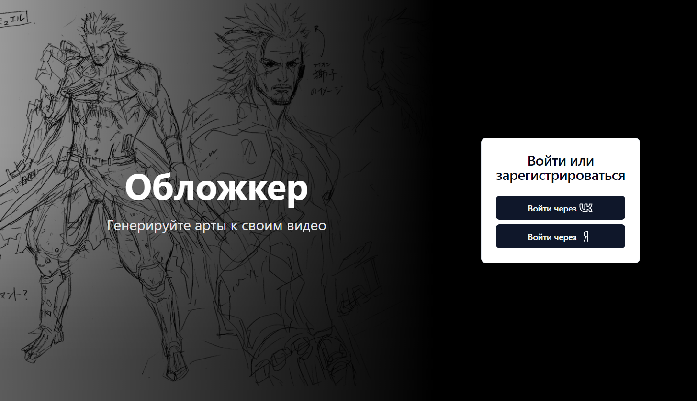
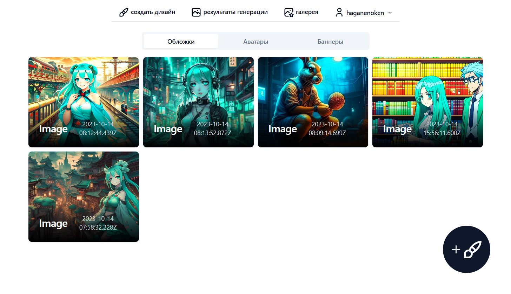
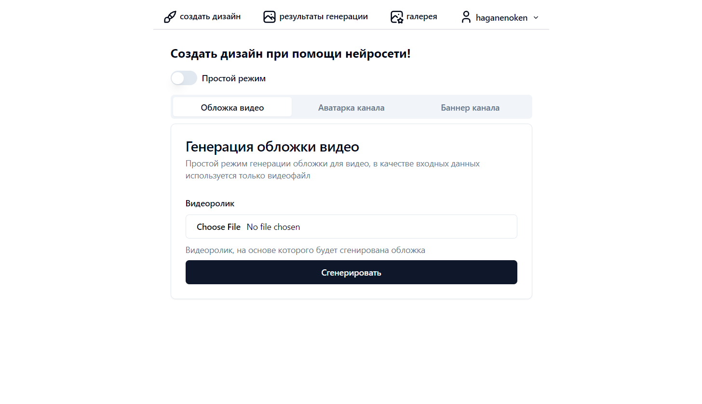

<h1 align="center">Обложкер</h1>

    <em>Сервис генерации обложек для видеороликов с помощью нейротехнологий</em>

## Содержание

* [Что такое Обложкер?](#что-такое-обложкер)
* [Начало работы](#начало-работы)
  * [Авторизация на сайте](#авторизация-на-сайте)
  * [Главная страница](#главная-страница)
  * [Генерация обложек](#генерация-обложек)
  * [Работа с библиотекой](#работа-с-библиотекой)
  * [Редактирование изображений](#редактирование-изображений)
  * [Сохраненные фотографии](#сохраненные-фотографии)
* [Часто задаваемые вопросы](#часто-задаваемые-вопросы)
* [Обратная связь](#обратная-связь)

---

## Что такое Обложкер?

_Обложкер_ --  это сервис, позволяющий контент-мейкерам создавать обложки для видео, фото профиля, а также баннеры канала для соцсетей. Любой желающий может загрузить видео и сгенерировать на его основе изображение, отражающее тематику и содержание видео. Помимо этого, сервис предоставляет возможность нанесения на полученные картинки текста и/или фотографии автора.

## Начало работы

В этом разделе будут рассмотрены основные сценарии использования Обложкера.

### Авторизация на сайте

Чтобы начать использовать Обложкер, необходимо пройти авторизацию на сервисе. При переходе на сайт, если Вы ранее не проходили авторизацию, Вы увидите страницу логина. На данный момент доступны два вида авторизации на сервисе:

* **С помощью VK.**
Для авторизации с помощью VK, нажмите на кнопку "Войти через VK"

* **С помощью Яндекс.**
Для авторизации с помощью аккаунта в Яндекс, нажмите на кнопку "Войти через Яндекс"

При использовании любого из способов, после нажатия  следуйте инструкциям во всплывающем окне для авторизации на сервисе.

### Главная страница

Первое, что видит авторизованный пользователь на сайте, -- это коллекцию сгенерированных изображений.

Переход между разделами сайта осуществляется с помощью навигационной панели, расположенной вверху страницы. Давайте подробнее рассмотрим каждый из её элементов.

* *Создать дизайн*
При нажатии на эту ссылку, Вас перенаправит на страницу [генерации новых изображений](#генерация-обложек).

* *Результаты генерации*
Эта ссылка ведет на раздел сайта, содержащий результаты Ваших предыдущих генераций изображений. О более подробном описании работы данного раздела читайте [здесь](#работа-с-библиотекой).

* *Галерея*
Этот раздел сайта отличается от предыдущего тем, что в нем хранятся изображения, отредактированные **пользователем**. Подробнее про галерею читайте [в этой части](#сохраненные-фотографии).

* *Раздел с именем пользователя*
Отражает имя пользователя текущей сессии. Для того, чтобы деавторизоваться, наведите на данный раздел и выберите пункт "Выйти" из выпадающего меню.

### Генерация обложек

При переходе в раздел генерации изображений пользователя встречает форма для ввода необходимой информации. Давайте разберем процесс создания запроса поэтапно.

1. Для начала определитесь со степень

### Работа с библиотекой
### Редактирование изображений
### Сохраненные фотографии

## Часто задаваемые вопросы
## Обратная связь
