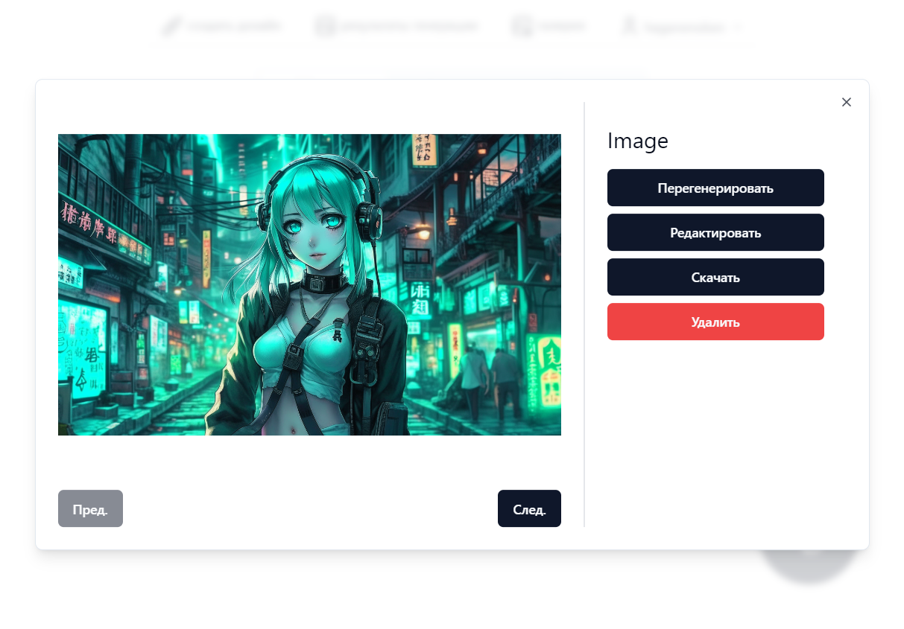

<h1 align="center">Обложкер</h1>

    <em>Сервис генерации обложек для видеороликов с помощью нейротехнологий</em>

## Содержание

* [Что такое Обложкер?](#что-такое-обложкер)
* [Начало работы](#начало-работы)
  * [Авторизация на сайте](#авторизация-на-сайте)
  * [Главная страница](#главная-страница)
  * [Генерация обложек](#генерация-обложек)
  * [Работа с библиотекой](#работа-с-библиотекой)
  * [Редактирование изображений](#редактирование-изображений)
  * [Сохраненные фотографии](#сохраненные-фотографии)
* [Часто задаваемые вопросы](#часто-задаваемые-вопросы)
* [Обратная связь](#обратная-связь)

---

## Что такое Обложкер?

_Обложкер_ --  это сервис, позволяющий контент-мейкерам создавать обложки для видео, фото профиля, а также баннеры канала для соцсетей. Любой желающий может загрузить видео и сгенерировать на его основе изображение, отражающее тематику и содержание видео. Помимо этого, сервис предоставляет возможность нанесения на полученные картинки текста и/или фотографии автора.

## Начало работы

В этом разделе будут рассмотрены основные сценарии использования Обложкера.

### Авторизация на сайте

Чтобы начать использовать Обложкер, необходимо пройти авторизацию на сервисе. При переходе на сайт, если Вы ранее не проходили авторизацию, Вы увидите страницу логина. На данный момент доступны два вида авторизации на сервисе:

* **С помощью VK.**
Для авторизации с помощью VK, нажмите на кнопку "Войти через VK"

* **С помощью Яндекс.**
Для авторизации с помощью аккаунта в Яндекс, нажмите на кнопку "Войти через Яндекс"

При использовании любого из способов, после нажатия  следуйте инструкциям во всплывающем окне для авторизации на сервисе.

### Главная страница

Первое, что видит авторизованный пользователь на сайте, -- это коллекцию сгенерированных изображений.

Переход между разделами сайта осуществляется с помощью навигационной панели, расположенной вверху страницы. Давайте подробнее рассмотрим каждый из её элементов.

* *Создать дизайн*
При нажатии на эту ссылку, Вас перенаправит на страницу [генерации новых изображений](#генерация-обложек).

* *Результаты генерации*
Эта ссылка ведет на раздел сайта, содержащий результаты Ваших предыдущих генераций изображений. О более подробном описании работы данного раздела читайте [здесь](#работа-с-библиотекой).

* *Галерея*
Этот раздел сайта отличается от предыдущего тем, что в нем хранятся изображения, отредактированные **пользователем**. Подробнее про галерею читайте [в этой части](#сохраненные-фотографии).

* *Раздел с именем пользователя*
Отражает имя пользователя текущей сессии. Для того, чтобы деавторизоваться, наведите на данный раздел и выберите пункт "Выйти" из выпадающего меню.

### Генерация обложек

При переходе в раздел генерации изображений пользователя встречает форма для ввода необходимой информации. Давайте разберем процесс создания запроса поэтапно.

1. Для начала определитесь со степенью контроля, который хотите иметь над генерацией, и установите один из режимов с помощью переключателя в верхней части формы.
  * __Простой режим.__ (_Рекомендуется_) Для генерации изображений в этом режиме от пользователя потребуется лишь исходное видео.
  * __Продвинутый режим.__ В этом режиме Вы помимо видео, вы можете указывать стиль и количество генерируемых изображений, а также управлять другими опциями, подробнее о которых -- ниже.
2. Затем, с помощью вкладок установите тип генерируемого изображения. Тип "Обложка видео" подходит для изображений, предназначенных для использования в качестве обложек видеозаписей, "Аватарка канала" -- для фото профиля, а "Баннер канала" -- для баннерного изображения в соцсетях.
3. В зависимости от выбранного режима и типа генерируемого изображения, Вам необходимо заполнить поля формы.
  * *Видеоролик* -- видеофайл для обработки. На основе его содержания будет сгенерировано изображение.
  Замечание! При выборе типов изображений "Аватарка канала" или "Баннер канала" можно загрузить несколько видеороликов.
  * *Описание* -- текстовое описание того, что должно быть на изображении.
  * *Запреты* -- текстовое описание того, чего НЕ должно быть на изображении.
  * *Стиль* -- художественный стиль, в котором должно быть выполнено изображение. Выберите нужный Вам из вариантов выпадающего списка.
  * *Референс* (только для аватарок!) -- изображение, которое будет служить ориентиром для сгенерированный картинок. Сервис постарается сделать результат похожим на поданное изображение.
  * *Количество изображений* -- количество генерируемых изображений. Не больше 7 для "Обложек видео" и "Аваторок канала" и не больше 3 для "Баннеров канала".
4. Для завершения запроса нажмите кнопку "Сгенерировать"
5. Если генерация запустилась успешно, то Вас перенаправит в Вашу библиотеку сгенерированных изображений. В противном случае, указания об ощибках помогут Вам исправить вводимые данные.

### Работа с библиотекой

В разделе с результатами генерации Вы можете посмотреть и остлеживать свои... результаты генерации! Каждый элемент грида -- это коллекция изображений, сгенерированных ранее. Здесь также отображаются запросы, все ещё находящиеся в обработке.

Немного о возможностях данного раздела:

- Разные типы изображений находятся по разным вкладкам. Используйте переключатель в верхней части страницы для навигации между ними.
- Кликните на кнопку в правом нижнем углу, чтобы создать новую коллекцию изображений. Вас перенаправит в раздел [генерации картинок](#генерация-обложек).
- Кликните на элемент грида, чтобы посмотреть всю коллекцию изображений из запроса. При нажатии, открывается модальное окно, где отображается коллекция картинок в большем размере, а также предлагаются на выбор действия с ней.

- Кнопки "Пред." и "След." используются для просмотра предыдущего/следующего изображения в коллекции
- Если ни одно из изображений не произвело на Вас впечатления, Вы можете нажать кнопку "Перегенерировать". Запрос генерации выполнится заново, с теми же параметрами.
- Чтобы продолжить работать и редактировать картинку из коллекции нажмите "Редактировать". Вы будете перенаправлены в раздел [редактирования изображений](#редактирование-изображений).

- При нажатии на кнопку "Скачать" картинка загружается на Ваше устройство.
- Нажмите "Удалить", чтобы удалить коллекцию из Ваших результатов генерации.

### Редактирование изображений

Сервис предоставляет минималистичный графический редактор, для того чтобы Вы могли редактировать свои сгенерированные изображения, не уходя с сайта. Добавить текст, ещё одно изображение поверх исходного -- все это доступно "из-под коробки"

После окончания изменений Вы можете сохранить картинку в [Галерею](#сохраненные-фотографии).

### Сохраненные фотографии

Здесь отображаются картинки, отредактированные и сохраненные ранее Вами, и отсюда же Вы можете их скачать в любой момент. Для этого достаточно просто нажать кнопку "Скачать" под выбранным изображением, и тогда откроется новая вкладка с картинкой в полном размере.

## Часто задаваемые вопросы

* **Q**: А у Вас есть диаграмма сценариев?
**A**: Конечно! Вот [тут](./docs/diagrams/usecase.png).

## Обратная связь

   
      <em>Никита Семёнов</em>
      •
      <a href="mailto:apexkennys@gmail.com">
         apexkennys@gmail.com
      </a>
    
   
      <em>Николай Филин</em>
      •
      <a href="mailto:nfilin@cs.petrsu.ru">
         nfilin@cs.petrsu.ru
      </a>
    
   
      <em>Евгений Харичев</em>
      •
      <a href="mailto:ge01nia85@gmail.com">
         ge01nia85@gmail.com
      </a>
    
   
      <em>Никон Подгорный</em>
      •
      <a href="mailto:podgorny.nikon@yandex.ru">
         podgorny.nikon@yandex.ru
      </a>
    
   
      <em>Арсений Фомин</em>
      •
      <a href="mailto:fomin@cs.petrsu.ru">
         fomin@cs.petrsu.ru
      </a>
   

